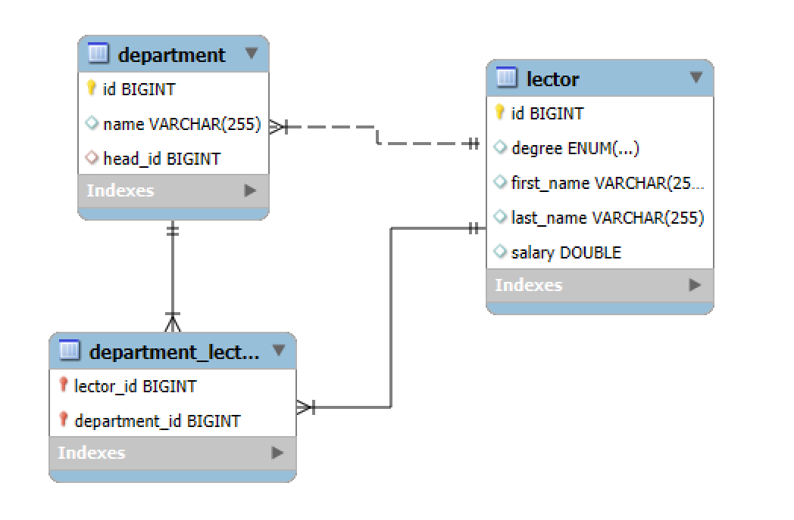

# University Manager

A Spring Boot console application with a MySQL DB.

---

## 1. Requirements

- Java 17+
- Maven
- MySQL Server

---

## 2. Database Setup

Before starting the application, create the database in your MySQL server.

```sql
CREATE DATABASE university;
```

Make sure your MySQL server is running and accessible at `localhost:3306`.

---

## 3. Application Properties Configuration

The configuration is defined in `src/main/resources/application.properties`.

- `spring.datasource.url`: JDBC URL for your database.
- `spring.datasource.username`: MySQL username.
- `spring.datasource.password`: MySQL password.
- `spring.jpa.hibernate.ddl-auto`: Schema auto-update.

---

## 4. Running the Application

### Build the Application

Skip tests to speed up the packaging:

```bash
mvn clean package -DskipTests
```

This will generate a JAR file in the `target/` directory.

### Run the Application

```bash
java -jar target/university-manager-0.0.1-SNAPSHOT.jar
```

You should see:

```text
Welcome to University App
Type your command:
```

Now you can interact with the application via the console.

### Stop the Application

To stop the application, write `exit` in the terminal where it's running.

---

## 5. Database Model Diagram



---

## 6. Notes

- Ensure MySQL driver dependency is included in your `pom.xml`.
- The database `university` must exist before running the app.

---
